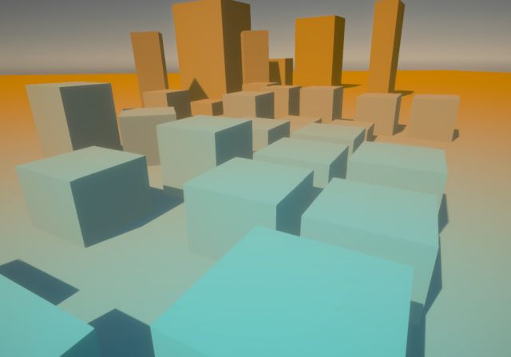

# Depth Color Grading for URP

"Depth Color Grading for Unity URP" is a color grading which respects depth value.

## Prerequisites

- Unity 2021.2 or greater.
- URP (Universal Render Pipeline) 12.1 or greater.

## Installation

- Create new "3D (URP)" template Unity project.
- Put all `Assets/*` files from this repository into your `Assets/` directory.
- Select your "Universal Renderer Data" asset in Project view.
  - If you're using URP template, there're `Assets/Settings/*-Renderer.asset` files.
  - Press "Add Renderer Feature" in the Inspector.
    - Select "Depth Color Grading Feature"
- Put some 3D objects in the scene.
- Select "Global Volume" object in Hierarchy view.
  - Press "Add Override" button in the Inspector.
    - Select "Depth Color Grading".
  - Press "Volume > Depth Color Grading > ALL".
  - Move "Depth Color Grading > Blend" slider to "1.0".
  - Set blue color to "Depth Color Grading > Tint 0".
  - Set red color to "Depth Color Grading > Tint 1".
  - Move "Depth Color Grading > Falloff" slider.

## Parameters

|Name           |Value                                                                  |
|--             |--                                                                     |
|Blend          |Overall color grading blend intensity.                                 |
|Skybox Blend   |Color grading blend intensity for skybox.                              |
|Falloff        |Falloff curve.                                                         |
|H0             |Hue for near color grading                                             |
|S0             |Saturation for near color grading                                      |
|L0             |Lightness for near color grading                                       |
|Gamma0         |Gamma for near color grading                                           |
|Tint0          |Tint color for near color grading.  Alpha means blending intensity.    |
|Lift0          |Lift color for near color grading.  Alpha means blending intensity.    |
|               |                                                                       |
|... 1          |Parameters for *far* color grading                                     |

## Notes

- This is a sample project for educational purpose.

## License

* [MIT License.](./LICENSE)
